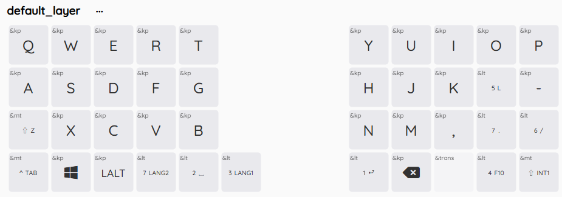

# キーマップ（非オートマウスレイヤー）
初期設定はJIS配列、オートマウスレイヤーありとなっています。オートマウスレイヤーが不要な場合はmain-non-amlブランチをご使用ください。  
ロータリーエンコーダーはどのレイヤーでも音量のUP/DOWNになっています。  

## レイヤー0
デフォルトのレイヤー  
「⇧Z」など2種類記載されているキーは、ModTapです。  
「⇧Z」の場合、短押しではZが入力され、長押しでは⇧（Shift）が入力されます。  
- 数字：押している間各レイヤーに切り替わる（5:縦スクロール、6:マウスレイヤー、7:横スクロール）
- ⇧：Shift  
- ＾：Control
- ↵ ：Enter
- LANG1：ひらがな
- LANG2：半角英数字

## レイヤー1
ファンクションキー  

## レイヤー2
数字・記号キー  
※ Keymap Editor等GUI上で見ると異なっているように見えますが、

## レイヤー3
方向キー、タブ切り替えなど  

## レイヤー4
Bluetoothの設定や切り替えをする  
最大5台の端末にてマルチペアリングが可能です。キーボードの電源をオンにしたのちBT_SEL_0 ～ BT_SEL_4のいずれかを押して端末と接続してください。
- BT_CLR：選択中のBluetooth設定を初期化する
- BT_CLR_ALL：5個すべてのBluetooth設定を初期化する

## レイヤー5
縦スクロールレイヤー  
キーはデフォルトでは未割当  

## レイヤー6
マウスレイヤー  
- MB1：左クリック
- MB2：右クリック
- MB3：中央クリック

## レイヤー7
マクロ・横スクロールレイヤー  
個人的によく使用するスクリーンショットやInsertを使用するコピー・ペースト等を設定しています。  

